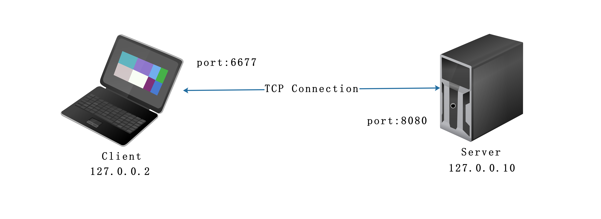
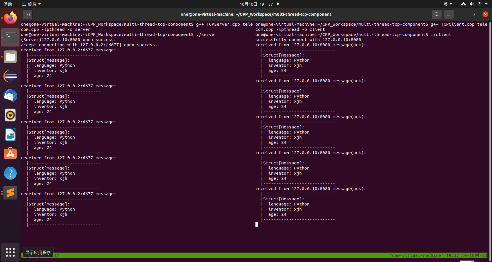
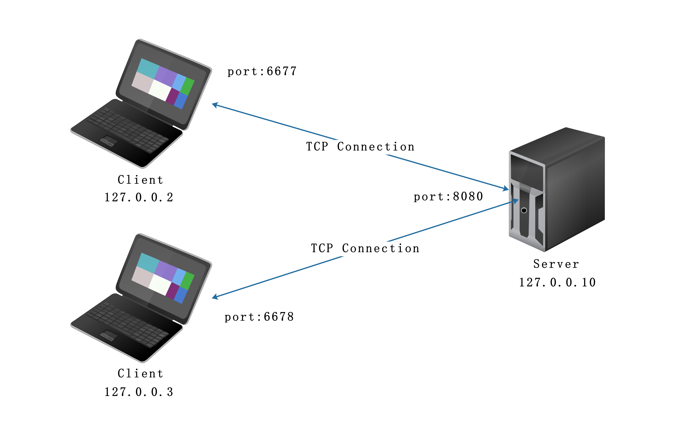
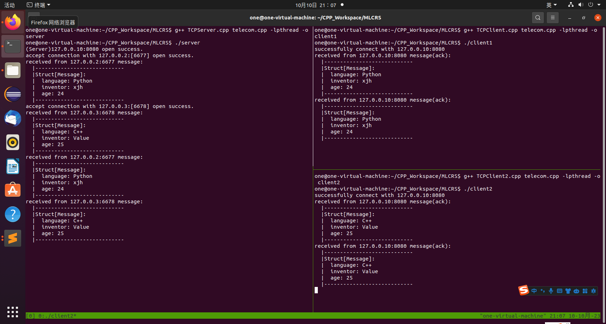

## Multi-thread TCP/UDP Components

We encapsulate cumbersome `Socket API` and `multithreaded`. Developers can directly create their own servers or clients without paying attention to the communication details of internal TCP/UDP, so as to quickly emulate the network in the first place. 

## Table of contents

- [License](#License)
- [Usage](#Usage)
  - [Example](#Example)
  - [Quick Start](#Quick-Start)
  - [API](#API)
  - [Overwrite Message Struct](#Overwrite-Message-Struct)
- [Subsequent optimizations](#Subsequent-optimizations)
- [Supported Platforms](#Supported-Platforms)
- [Contributors](#Contributors)

## License

>   Copyright (c) 2023 Value
>
>   Permission is hereby granted, free of charge, to any person obtaining a copy
>   of this software and associated documentation files (the "Software"), to deal
>   in the Software without restriction, including without limitation the rights
>   to use, copy, modify, merge, publish, distribute, sublicense, and/or sell
>   copies of the Software, and to permit persons to whom the Software is
>   furnished to do so, subject to the following conditions:
>
>   The above copyright notice and this permission notice shall be included in
>   all copies or substantial portions of the Software.
>
>   THE SOFTWARE IS PROVIDED "AS IS", WITHOUT WARRANTY OF ANY KIND, EXPRESS OR
>   IMPLIED, INCLUDING BUT NOT LIMITED TO THE WARRANTIES OF MERCHANTABILITY,
>   FITNESS FOR A PARTICULAR PURPOSE AND NONINFRINGEMENT. IN NO EVENT SHALL THE
>   AUTHORS OR COPYRIGHT HOLDERS BE LIABLE FOR ANY CLAIM, DAMAGES OR OTHER
>   LIABILITY, WHETHER IN AN ACTION OF CONTRACT, TORT OR OTHERWISE, ARISING FROM,
>   OUT OF OR IN CONNECTION WITH THE SOFTWARE OR THE USE OR OTHER DEALINGS IN
>   THE SOFTWARE.

## Usage

### Example

#### Example 1 : a Server with a Client

​	

- 进入命令行键入如下命令

  ```bash
  mkdir project 
  cd project 
  git clone https://github.com/Special-JiaHao/multi-thread-tcp-compose.git
  g++ TCPServer.cpp telecom.cpp -lpthread -o server
  g++ TCPClient.cpp telecom.cpp -lpthread -o client
  ./server	# 窗口一
  ./client    # 窗口二
  ```

- 运行结果

  

#### Example 2 : a server with two client

​	

- 进入命令行键入如下命令

  ```bash
  mkdir project 
  cd project 
  git clone https://github.com/Special-JiaHao/multi-thread-tcp-compose.git
  g++ TCPServer.cpp telecom.cpp -lpthread -o server
  g++ TCPClient.cpp telecom.cpp -lpthread -o client1
  g++ TCPClient2.cpp telecom.cpp -lpthread -o client2
  ./server	# 窗口一
  ./client1   # 窗口二
  ./client2   # 窗口三
  ```

- 运行结果

  

### Quick Start

- **Server**

  1. create a server, with address's type, address, tag. `AF_INET` represent `IPV4`， tag represent for the name you gave the device.  

     ```cpp
     # Server(address's type, address, tag)
     Server server(AF_INET, "127.0.0.10", "Server");
     ```

  2. open the TCP Port, waiting the client connection. 

     ```cpp
     server.openTCP_Port(8080);
     ```

- **Client**

  1. create a client, with address's type, address, tag. `AF_INET` represent `IPV4`， tag represent for the name you gave the device.  

     ```cpp
     # Client(address's type, address, tag)
     Client client(AF_INET, "127.0.0.2", "Client");
     ```

  2. Define the port for the server

     ```cpp
     struct sockaddr_in *serverAddr = Tele_CreateSocketAddress(AF_INET, "127.0.0.10", 8080);
     ```

  3. Connect with server

     ```cpp
     int sockfd = client.TCPConnect(*serverAddr, 6677);
     ```

  4. Send Message

     ```cpp
     Message message((char*)"Python", (char *)"xjh", 24);
     client.push_backTCPSendBuf(sockfd, message);
     client.TCPSend(sockfd);
     ```

### API

- **Server**

- **Client**

- **Tele_CreateSocketDescriptor**：creates an endpoint for communication and returns a file descriptor that refers to that endpoint. The file descriptor returned by a successful call will be the lowest-numbered file descriptor not currently open for the process. On success, a file descriptor for the new socket is returned.  On error, -1 is returned.

  ```C++
  extern int Tele_CreateSocketDescriptor(int family, int type, int protocol);
  /*
  Description:
  	- family : argument specifies a communication domain; this selects the protocol family which will be used for communication. The same argument with socket:domain
  		+ Af_INET : IPv4 Internet protocols 
  		+ AF_INET6 :  IPv6 Internet protocols 
      - 
  */
  ```

- **Tele_CreateSocketAddress**

- **Tele_Bind**

- **Tele_Listen**

- **Tele_BindAndListen**

- **Tele_Accept**

- **Tele_Connect**

- **Tele_Receive**

- **Tele_Send**

### Overwrite Message Struct

The following is the structure of the communication message I defined（you can overwrite it）

```c++
# telecom.h
struct Message{
	char language[100];
	char inventor[100];
	int age;
	Message(){};
	Message(char *language, char * inventor, int age);
	Message(std::string language, std::string inventor, int age);
};
typedef struct Message Packet;
extern std::ostream& operator<<(std::ostream& out, Message& message);
# telecom.cpp
/* Mesaage Constructor */
Message::Message(char *language, char *inventor, int age)
{
	this->age = age;
	for(int i = 0; i < 99 && language[i]; i ++ )
	{
		this->language[i] = language[i];
		if(language[i + 1] == '\0')	this->language[i + 1] = '\0';
	}
	for(int i = 0; i < 99 && inventor[i] != '\0'; i ++ )
	{
		this->inventor[i] = inventor[i];
		if(inventor[i + 1] == '\0')	this->inventor[i + 1] = '\0';
	}	
}
/* Mesaage Constructor */
Message::Message(std::string language, std::string inventor, int age)
{
	this->age = age;
	for(int i = 0; i < language.size(); i ++ )
	{
		this->language[i] = language[i];
		if(i == language.size() - 1)	this->language[i + 1] = '\0';
	}	
	for(int i = 0; i < inventor.size(); i ++ )
	{
		this->inventor[i] = inventor[i];
		if(i == inventor.size() - 1)	this->inventor[i + 1] = '\0'; 
	}	
}
/* override << Mesaage */
std::ostream& 
operator<<(std::ostream& out, Message& message){
	std::string language, inventor;
	for(int i = 0; i < 100 && message.language[i]; i ++ )	language += message.language[i];
	for(int i = 0; i < 100 && message.inventor[i]; i ++ )	inventor += message.inventor[i];
	out << "  |----------------------------" << std::endl;
	out << "  |Struct[Message]: " << std::endl;
	out << "  |  language: " << language << std::endl;
	out << "  |  inventor: " << inventor << std::endl;
	out << "  |  age: " << message.age << std::endl;
	out << "  |----------------------------";
    return out;
}
```

If you want to send different data, you can overwrite the `Message` struct.

## Subsequent optimizations

- Use the thread pool to manage threads

## Supported Platforms

- Linux

## Contributors

- Value(author)

